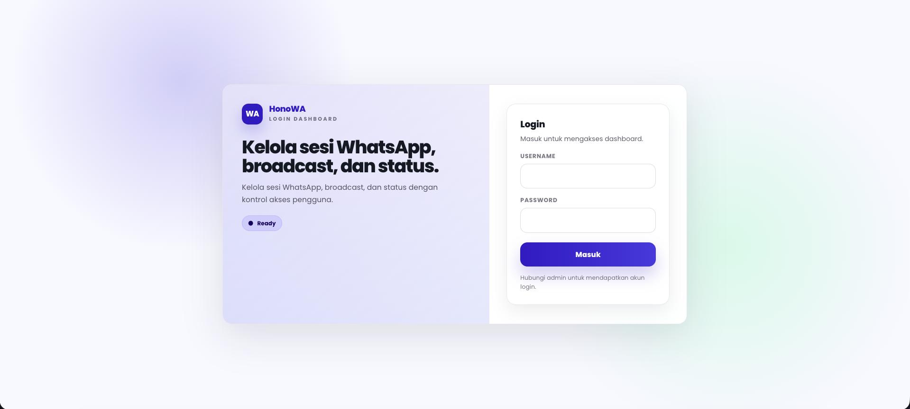
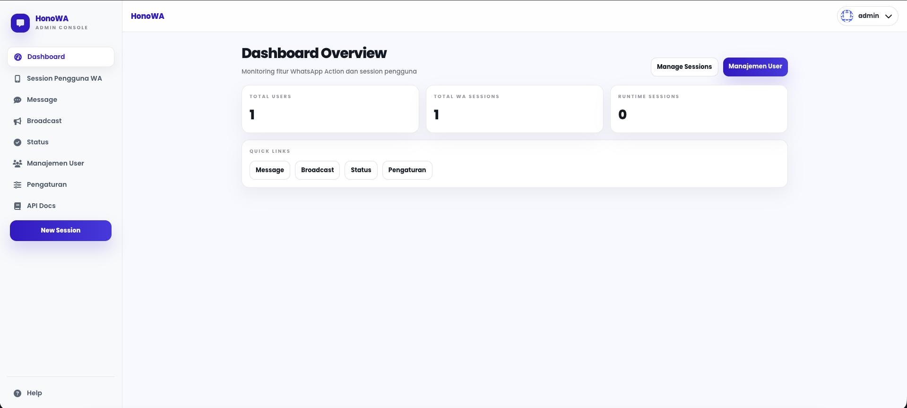
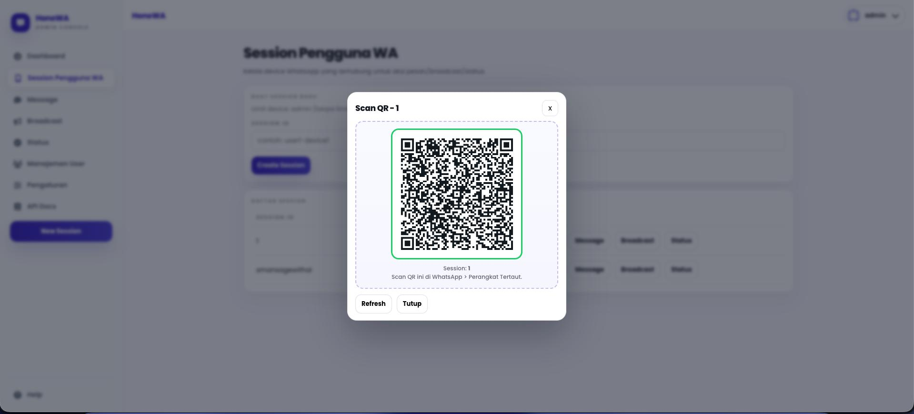

<div align="center">
  
</div>

# HonoWA — Hono.js + Unofficial WhatsApp API

REST API dan Admin Dashboard untuk mengelola sesi WhatsApp (multi-session) menggunakan **Hono.js** dan **whatsapp-web.js** (unofficial).

```bash
npm install
npm run dev
```

Buka:

```
http://localhost:3000/login
```

## Preview

**Login**



**Dashboard**



**Scan QR WhatsApp**



---

## 🐳 Quick Start

```bash
docker run -d \
  --name whatsapp-api \
  -p 3000:3000 \
  -v $(pwd)/data:/app/data \
  -v $(pwd)/.wwebjs_auth:/app/.wwebjs_auth \
  username/whatsapp-api:latest
```

API siap diakses di `http://localhost:3000`

---

## 📦 Docker Compose

```yaml
version: "3.8"
services:
  whatsapp-api:
    image: username/whatsapp-api:latest
    container_name: whatsapp-api
    restart: unless-stopped
    ports:
      - "3000:3000"
    volumes:
      - ./data:/app/data
      - ./.wwebjs_auth:/app/.wwebjs_auth
```

```bash
docker compose up -d
```

---

## 💾 Volume yang Digunakan

| Volume              | Keterangan                                                   |
| ------------------- | ------------------------------------------------------------ |
| `/app/data`         | Menyimpan `session.json` (metadata sesi)                     |
| `/app/.wwebjs_auth` | Menyimpan autentikasi WhatsApp (agar tidak perlu scan ulang) |

> **Penting:** Mount kedua volume ini agar sesi tidak hilang saat container restart.

---

## 📡 Base URL

```
http://localhost:3000
```

---

## 🔗 Daftar Endpoint

### `GET /session/qr/:sessionId`

Membuka halaman HTML berisi QR Code untuk menghubungkan WhatsApp.

```
GET /session/qr/sesi1
```

Buka di browser, scan QR dengan WhatsApp.

---

### `POST /session/pair/:sessionId`

Pairing menggunakan kode angka sebagai alternatif QR.

**Request Body:**
| Field | Tipe | Wajib | Keterangan |
|---|---|---|---|
| `phone` | `string` | ✅ | Nomor HP (format `08xx` atau `62xx`) |

```json
{
  "phone": "081234567890"
}
```

**Response:**

```json
{
  "success": true,
  "sessionId": "sesi1",
  "pairingCode": "ABCD-1234",
  "message": "Buka WhatsApp > Perangkat Tertaut > Tautkan Perangkat, lalu masukkan kode ini."
}
```

---

### `GET /session/status/:sessionId`

Mengecek status sesi.

```
GET /session/status/sesi1
```

**Response:**

```json
{
  "sessionId": "sesi1",
  "status": "ready",
  "exists": true,
  "readyAt": "2024-01-01T00:00:00.000Z"
}
```

**Nilai status:**
| Status | Keterangan |
|---|---|
| `initializing` | Sedang diinisialisasi |
| `pending_pairing` | Menunggu scan QR / pairing code |
| `ready` | Aktif dan siap digunakan |
| `disconnected` | Terputus |
| `not_found` | Tidak ditemukan |

---

### `GET /sessions`

Menampilkan semua sesi yang aktif.

```json
{
  "total": 2,
  "sessions": [
    {
      "sessionId": "sesi1",
      "status": "ready",
      "readyAt": "2024-01-01T00:00:00.000Z"
    },
    {
      "sessionId": "sesi2",
      "status": "initializing",
      "readyAt": "2024-01-01T00:01:00.000Z"
    }
  ]
}
```

---

### `POST /send/:sessionId`

Kirim pesan teks ke nomor WhatsApp.

**Request Body:**
| Field | Tipe | Wajib | Keterangan |
|---|---|---|---|
| `phone` | `string` | ✅ | Nomor tujuan (format `08xx` atau `62xx`) |
| `message` | `string` | ✅ | Isi pesan |

```json
{
  "phone": "081234567890",
  "message": "Halo! Ini pesan otomatis."
}
```

**Response:**

```json
{
  "success": true,
  "message": "Pesan terkirim via sesi 'sesi1'"
}
```

---

### `POST /send-group/:sessionId`

Kirim pesan ke grup WhatsApp.

**Request Body:**
| Field | Tipe | Wajib | Keterangan |
|---|---|---|---|
| `groupId` | `string` | ✅ | ID grup (format `120363xxxxxx@g.us`) |
| `message` | `string` | ✅ | Isi pesan |

```json
{
  "groupId": "120363123456789012@g.us",
  "message": "Halo semua anggota grup!"
}
```

**Response:**

```json
{
  "success": true,
  "message": "Pesan ke grup berhasil dikirim"
}
```

---

### `POST /status/:sessionId`

Membuat status WhatsApp (Story).

**Request Body:**
| Field | Tipe | Wajib | Keterangan |
|---|---|---|---|
| `text` | `string` | ✅ (tanpa media) | Teks isi status |
| `mediaUrl` | `string` | ❌ | URL gambar/video untuk status media |

```json
// Status teks
{ "text": "Halo! Ini status otomatis." }

// Status media
{ "mediaUrl": "https://example.com/gambar.jpg", "text": "Caption di sini" }
```

**Response:**

```json
{
  "success": true,
  "message": "Status dibuat via sesi 'sesi1'"
}
```

---

### `DELETE /session/:sessionId`

Logout dan hapus sesi.

```
DELETE /session/sesi1
```

**Response:**

```json
{
  "success": true,
  "message": "Sesi 'sesi1' berhasil dihapus dan dilogout"
}
```

---

### `POST /broadcast/:sessionId`

Kirim pesan ke banyak nomor sekaligus.

**Request Body:**
| Field | Tipe | Wajib | Default | Keterangan |
|---|---|---|---|---|
| `phones` | `string[]` | ✅ | — | Array nomor tujuan, maks 200 nomor |
| `message` | `string` | ✅ | — | Isi pesan |
| `delayMs` | `number` | ❌ | `2000` | Jeda (ms) antar pengiriman |

```json
{
  "phones": ["081234567890", "089876543210"],
  "message": "Halo! Ini pesan broadcast.",
  "delayMs": 3000
}
```

**Response:**

```json
{
  "success": true,
  "sessionId": "sesi1",
  "summary": { "total": 2, "sent": 1, "failed": 1 },
  "results": [
    { "phone": "081234567890", "status": "sent" },
    { "phone": "089876543210", "status": "failed", "error": "invalid number" }
  ]
}
```

---

## ⚠️ Catatan Penting

- Semua endpoint (kecuali `/session/qr` dan `/session/pair`) memerlukan sesi berstatus **`ready`**.
- Format nomor HP: `08xx` atau `62xx` — awalan `0` otomatis dikonversi ke `62`.
- Sesi terputus akan dihapus otomatis dari memori setelah **30 detik**.
- Broadcast dibatasi maksimal **200 nomor** per request.
- Mount volume `/app/.wwebjs_auth` agar sesi tidak perlu scan ulang setelah container restart.
